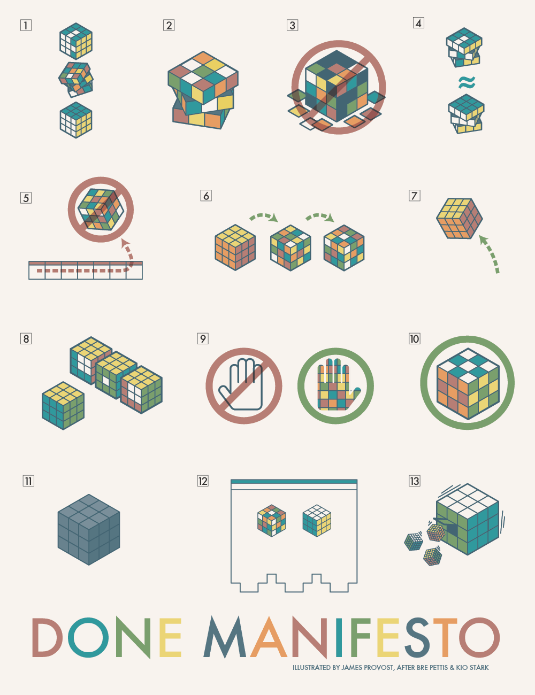

Title: The Cult of Done Manifesto
Date: 2021-05-14 15:28
Modified: 2021-05-14 15:28
Author: filipgorczynski
Category: Life
Tags: #cult-of-done, #manifesto, #productivity, #self-care, #life
Slug: the-cult-of-done-manifesto
Status: draft
Summary: Have you ever felt overwhelmed by hustle culture, by raising the bar every day, by moving your boundaries much too far - which of course drives you crazy due to all the goals you planned to accomplish to make your inner perfectionist happy?

Have you ever felt overwhelmed by hustle culture, by raising the bar every day, by moving your boundaries much too far - which of course drives you crazy due to all the goals you planned to accomplish to make your inner perfectionist happy?

Sadly, I did. While searching an easy solution to beat this procrastinating behaviour I've found _"The Cult of Done manifesto"_ document.

One (from the many) of my problems is that I have a feeling, that I need to postpone action until I'll be completely ready for it. This way I'm not as good as I could be with software development, being entrepreneur or many other things - because I'm still not perfectly ready. Even if I know I'll never be fully prepared I'm still not satisfied and thus procrastinate.

So what exactly "The Cult of Done" manifesto really is?

???I think the best way to summarize this attitude is a quote by Theodore Roosevelt.

> "The only person who never makes a mistake is the person who never does anything."

Just to note, there were a few more people that explains this idea with just different words.

Note: I’ll use examples from my last endeavor to make my points a bit clearer.

Simply speaking, everything we do - especially as developers - is an infinite process.

## "The Cult of Done Manifesto"

_Bre Pettis and Kio Stark_

1. There are three states of being. Not knowing, action and completion.
2. Accept that everything is a draft. It helps to get done.
3. There is no editing stage.
4. Pretending you know what you’re doing is almost the same as knowing what you are doing, so just accept that you know what you’re doing even if you don’t and do it.
5. Banish procrastination. If you wait more than a week to get an idea done, abandon it.
6. The point of being done is not to finish but to get other things done.
7. Once you’re done you can throw it away.
8. Laugh at perfection. It’s boring and keeps you from being done.
9. People without dirty hands are wrong. Doing something makes you right.
10. Failure counts as done. So do mistakes.
11. Destruction is a variant of done.
12. If you have an idea and publish it on the internet, that counts as a ghost of done.
13. Done is the engine of more.

`https://www.xaprb.com/blog/cult-of-done-manifesto/`

`https://christyler.ca/2017/01/26/done-is-the-engine-of-more/`

`https://medium.com/@bre/the-cult-of-done-manifesto-724ca1c2ff13`

